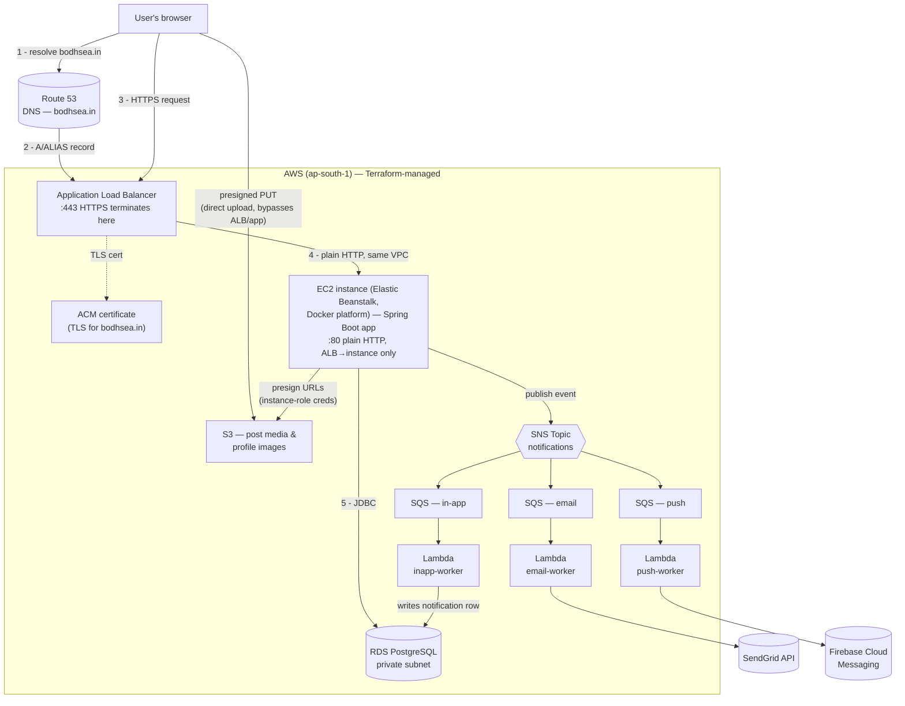

# Bodh Sea

A full-stack blogging & micro-social platform — write and publish posts, follow other writers,
react/comment/bookmark, repost content into your followers' feeds, and get notified across email,
push, and in-app channels. Built as a Spring Boot monolith on the backend with server-rendered
Thymeleaf views, deployed on AWS with Terraform-managed infrastructure.

## Table of Contents

- [About](#about)
- [Architecture](#architecture)
- [Tech Stack](#tech-stack)
- [Features](#features)
- [Project Structure](#project-structure)
- [Getting Started](#getting-started)
  - [Prerequisites](#prerequisites)
  - [Local Setup](#local-setup)
  - [Environment Variables](#environment-variables)
- [Deployment](#deployment)
- [License](#license)

## About

Bodh Sea ("the ocean of thought") is a blog/microblog hybrid: users write long-form posts with
rich media, follow each other, react and comment, bookmark posts for later, and repost others'
content into their own followers' feeds. It started as a classic server-rendered CRUD blog and
grew into a real, deployed AWS application with its own notification pipeline (email/push/in-app
via SNS → SQS → Lambda), direct-to-S3 media uploads, and infrastructure fully defined as code.

## Architecture



- **DNS**: `bodhsea.in` is registered with a third-party registrar; Route 53 is the authoritative
  DNS host (the registrar's nameservers are delegated to Route 53's 4 nameservers). An `A`/`ALIAS`
  record on the apex domain (and `www`) points at the Application Load Balancer.
- **TLS / load balancing**: Elastic Beanstalk runs the app as a `LoadBalanced` environment — an
  Application Load Balancer (ALB) sits in front of the EC2 instance, terminates HTTPS on port 443
  using a free ACM certificate issued for `bodhsea.in` (DNS-validated via Route 53), and forwards
  plain HTTP to the instance on port 80 inside the same VPC. The instance is never reached
  directly from the internet on 443 — only the ALB holds the certificate.
- **App server**: a single Spring Boot process on that EC2 instance, managed by Elastic Beanstalk
  (Docker platform) — no separate frontend/backend split, Thymeleaf renders full pages and
  fragments server-side, vanilla JS handles the interactive bits (reactions, bookmarks, reposts,
  infinite scroll, modals).
- **Database**: PostgreSQL on RDS in production (private subnet, reachable only from the app
  instance's own security group); H2 in-memory for local development.
- **Media uploads**: images/video for posts and profile/cover photos upload directly from the
  browser to S3 via short-lived presigned URLs — the app server (and the ALB) never proxy file
  bytes; only the small presign request/response round-trips through the app.
- **Notifications**: the app publishes one event to an SNS topic per notification; three SQS
  queues (email/push/in-app), each with its own subscription filter, fan it out to three
  independent Lambda workers. `inapp-worker` writes the notification straight to Postgres;
  `email-worker` calls SendGrid; `push-worker` calls Firebase Cloud Messaging.
- **Infrastructure as code**: every AWS resource above is defined in `infra/terraform/` and the
  three Lambda workers live in `infra/lambdas/` as their own small Maven modules.

### Request/response path (a normal page load)

1. Browser resolves `bodhsea.in` — Route 53 answers with the ALB's address.
2. Browser opens an HTTPS connection to the ALB; the ALB presents the ACM certificate for
   `bodhsea.in` and terminates TLS there (the EC2 instance itself never handles TLS at all).
3. ALB forwards the now-decrypted request to the EC2 instance over plain HTTP, inside the VPC —
   this hop never leaves AWS's own network.
4. Spring Boot (behind Beanstalk's own reverse proxy on the instance) routes the request to a
   `@Controller`, which calls into a service/repository layer backed by RDS over JDBC.
5. The controller renders a Thymeleaf template (or fragment, for an AJAX/infinite-scroll request)
   server-side and returns HTML; the response retraces the same path back through the instance,
   the ALB (re-encrypting over HTTPS to the browser), out to the user.
6. A media upload (avatar, cover, post image/video) is the one path that *doesn't* retrace this
   route both ways: the browser asks the app for a short-lived presigned S3 URL (steps 1–5 above,
   but for a tiny JSON request/response), then PUTs the actual file bytes **directly to S3**,
   bypassing the ALB and app server entirely for the large part of the transfer.

## Tech Stack

**Backend**
- Java 21
- Spring Boot 3.4.2 (Web, Data JPA, Security, Thymeleaf, DevTools)
- Hibernate 6.6.5
- Spring Security 6.4.2
- Lombok, ModelMapper

**Frontend**
- Thymeleaf (server-rendered) + Thymeleaf Extras for Spring Security
- Vanilla JavaScript (no frontend framework/bundler)
- Hand-written CSS (no framework)

**Data**
- PostgreSQL (production, on AWS RDS)
- H2 (local development, in-memory)

**AWS services** (all provisioned via Terraform)
- Elastic Beanstalk (EC2/Docker, `LoadBalanced` environment) — app hosting
- Elastic Load Balancing (Application Load Balancer) — HTTPS termination, provisioned by
  Beanstalk itself as part of the `LoadBalanced` environment type
- RDS (PostgreSQL) — database
- S3 — post media and profile/cover image storage
- SNS + SQS + Lambda (Java 21) — the notification pipeline
- IAM — scoped roles/policies (instance role for the app, per-function roles for each Lambda)
- Route 53 — DNS for `bodhsea.in` (a hosted zone Terraform manages; the domain itself is
  registered with a separate third-party registrar and delegated to Route 53's nameservers)
- ACM — the free TLS certificate the load balancer presents for `bodhsea.in`, DNS-validated
  through the Route 53 zone above

**Third-party integrations**
- SendGrid — transactional email delivery
- Firebase Cloud Messaging — push notifications
- Cloudinary — legacy avatar storage path (being phased out in favor of direct S3 uploads)

**Other**
- Apache PDFBox — exporting a post as a PDF
- GitHub Actions — CI/CD (`.github/workflows/deploy.yml`), deploys to Elastic Beanstalk on every
  push to `master`

## Features

- Registration with email verification, login, password reset
- Rich post authoring: title, content, tags, and up to 4 images or 1 video per post
- Drafts (save without publishing) and full edit/delete, both gated by real server-side ownership
  checks, not just hidden UI
- Home feed with search, tag/author filters, and infinite scroll
- A dedicated "Following" feed showing posts by (and reposts made by) people you follow
- Reactions (like/dislike), threaded comments with their own reactions, bookmarks
- Reposting a post into your followers' feeds, with a "Reposts" tab on your own profile
- Follow/unfollow, follower and following lists
- Profile pages with avatar/cover photo (presets, custom colors, or an uploaded photo), bio,
  personal info management (username/email/mobile with OTP verification)
- Notifications across three channels: in-app (bell icon + notifications page), email, and push
- PDF export of a published post

## Project Structure

```
src/main/java/com/BlogApplication/Blog/
├── controllers/       # Thymeleaf page controllers
├── RestController/     # JSON/AJAX endpoints (reactions, bookmarks, reposts, media presign, ...)
├── services/           # Business logic interfaces
│   └── impl/            # Implementations
├── repositories/       # Spring Data JPA repositories + projection interfaces
├── models/              # JPA entities
├── payloads/            # DTOs / view models
├── security/            # Spring Security configuration
├── exceptions/           # Custom exceptions
└── util/                 # Stateless helpers (formatting, avatar presets, authorization checks)

src/main/resources/
├── templates/           # Thymeleaf pages and fragments/
├── static/CSS/          # Hand-written stylesheets
├── static/js/           # Vanilla JS, one file per feature
└── application*.properties

infra/
├── terraform/            # All AWS infrastructure as code
└── lambdas/               # email-worker / push-worker / inapp-worker (each its own Maven module)
```

## Getting Started

### Prerequisites

- JDK 21
- Maven (or use the bundled `./mvnw` wrapper — no separate install needed)
- Git

No local database install is required — the `docker` Spring profile runs entirely on an
in-memory H2 database.

### Local Setup

```bash
git clone git@github.com:gauravmishra-1404/BlogApplication.git
cd BlogApplication

# Run with the local, disposable H2 profile
./mvnw spring-boot:run -Dspring-boot.run.profiles=docker
```

The app starts on **http://localhost:8080**. With the `docker` profile:

- Database: H2 in-memory, schema auto-created/updated on startup, wiped on restart
- H2 console: http://localhost:8080/h2-console (JDBC URL `jdbc:h2:mem:blogdb`, user `sa`, no
  password)
- Email: `app.mail.enabled=false` — verification/notification emails are logged to the console
  instead of actually sent (look for `[DEV MAIL STUB]` lines), so registration works without any
  real email provider configured
- AWS-backed features (S3 media upload, SNS/SQS notifications) are inert locally by default —
  each has a `*.enabled=false` fallback bean, so the app runs fully without AWS credentials

Register a real account through the UI (`/registerUser`) to test the full flow — registration,
posting, reactions, comments, bookmarks, reposts, and following all work against the local H2
database with no external services required.

### Environment Variables

The default (non-`docker`) profile expects these to be set — via your shell, an `.env`-style
loader, or your deployment platform's own environment configuration. None are required to run the
`docker` profile locally.

| Variable | Purpose |
|---|---|
| `SPRING_DATASOURCE_URL` / `SPRING_DATASOURCE_USERNAME` / `SPRING_DATASOURCE_PASSWORD` | PostgreSQL connection |
| `APP_BASE_URL` | The app's own public URL, used to build absolute links in emails/notifications |
| `SENDGRID_API_KEY` / `SENDGRID_FROM_EMAIL` | Transactional email delivery |
| `CLOUDINARY_ENABLED` / `CLOUDINARY_CLOUD_NAME` / `CLOUDINARY_API_KEY` / `CLOUDINARY_API_SECRET` | Legacy avatar image hosting |
| `AWS_SQS_ENABLED` / `AWS_REGION` / `AWS_SNS_TOPIC_ARN` | Notification publishing (SNS) |
| `AWS_MEDIA_ENABLED` / `AWS_MEDIA_BUCKET` / `AWS_MEDIA_CDN_DOMAIN` | Direct-to-S3 post/profile media uploads |

AWS credentials for SNS/S3 access are **not** passed as environment variables in production — the
app reads them from its EC2 instance role's temporary credentials automatically via the AWS SDK's
default credential chain.

## Deployment

Production infrastructure is entirely defined in `infra/terraform/` (AWS provider, `ap-south-1`).
At a high level:

```bash
cd infra/terraform
terraform init
terraform plan
terraform apply
```

Routine app deploys (once infrastructure exists) happen automatically via
`.github/workflows/deploy.yml` on every push to `master` — it builds the jar, packages a deploy
bundle, and calls `elasticbeanstalk:UpdateEnvironment` directly, independent of Terraform. See
`infra/terraform/package-beanstalk.sh` for the manual/fallback deploy path.

The three notification Lambdas under `infra/lambdas/` are built separately (`mvn package` in each
module) before a Terraform apply picks up their jars.

## License

Licensed under the [Apache License 2.0](LICENSE).
